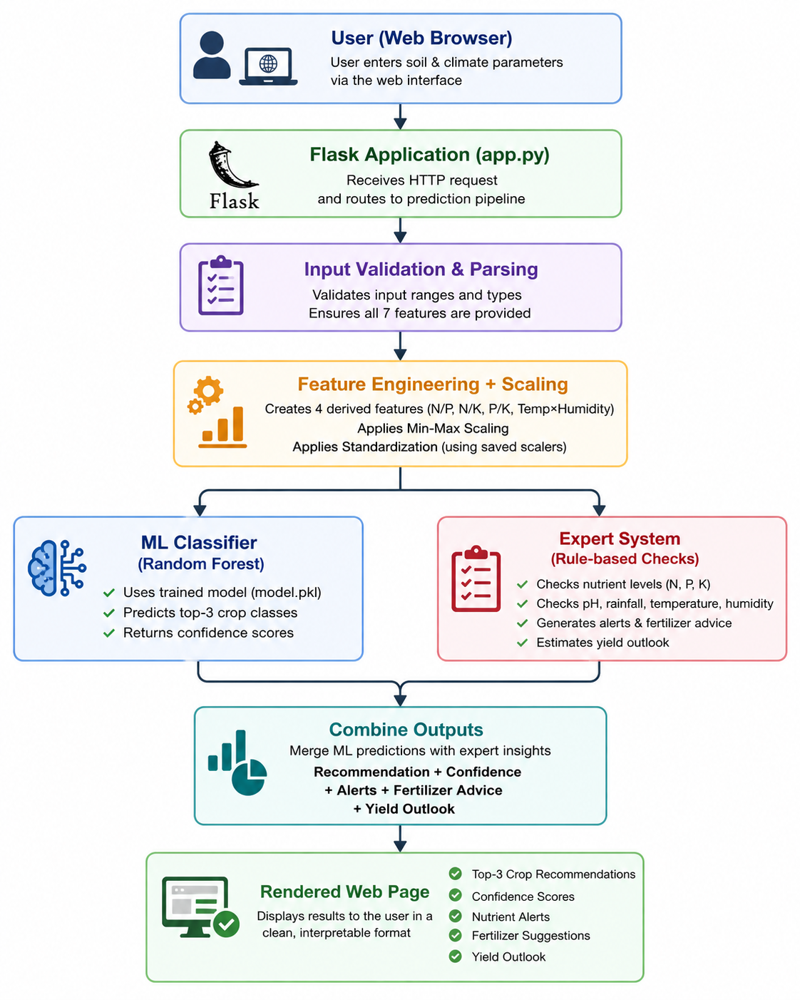

# AgriBrain: A Hybrid Machine Learning and Expert System Approach to Crop Recommendation

[](https://www.python.org/)
[](https://flask.palletsprojects.com/)
[](https://scikit-learn.org/)
[](https://xgboost.ai/)
[](https://pytest.org/)
[](LICENSE)

> 🌾 **AgriBrain** — A hybrid machine learning and expert-system approach to crop recommendation.


## 📖 Abstract

Choosing a suitable crop for a given field depends on the joint effect of several
soil and climatic variables — nitrogen, phosphorus, potassium, temperature,
humidity, soil pH, and rainfall — which makes the decision difficult to make
from intuition alone, particularly for inexperienced or resource-constrained
farmers. This project presents **AgriBrain**, a web-based crop recommendation
system that combines a supervised machine learning classifier with a
rule-based expert system. The classifier is trained on a labeled dataset of
2,200 field observations spanning 22 crop classes and, after comparing six
candidate algorithms under 5-fold cross-validation, a tuned Random Forest
model is selected, achieving 99.32% accuracy on a held-out test set. The
expert system layer applies deterministic agronomic rules to the same input
to generate interpretable nutrient alerts, fertilizer suggestions, and a
qualitative yield outlook, so that the system's output is not a bare label
but a short, explainable recommendation. The system is exposed through a
Flask web application with an accompanying model-comparison dashboard.

## 🌱 1. Introduction

### 💡 1.1 Motivation

Crop selection errors can lead to reduced yield, wasted inputs, and financial
loss, especially when a field's soil and climate conditions are not
well-matched to the crop being grown. Traditional decision-making for crop
selection often relies on farmer experience or generic regional practice,
which does not account for the specific nutrient and climatic profile of a
given plot. Machine learning offers a data-driven alternative, learning
patterns from historical records of which crops performed well under which
conditions.

### 🎯 1.2 Problem Statement

Given seven numerical field measurements — N, P, K, temperature, humidity,
pH, and rainfall — the goal is to recommend the most suitable crop(s) for
that field, and to accompany the recommendation with a brief, human-readable
explanation of any nutrient or environmental concerns, rather than a
classification label alone.

### 🧭 1.3 Objectives

- Train and compare multiple classification algorithms on a crop
  recommendation dataset and select the best-performing model.
- Engineer additional features that capture nutrient ratios and a simple
  climate interaction term, and evaluate their effect on model input.
- Design a lightweight, rule-based expert system that supplements the ML
  prediction with interpretable agronomic guidance.
- Package the system as a usable Flask web application with a metrics view
  for inspecting model performance.

## 📊 2. Dataset

The dataset (`data/Crop_recommendation.csv`) consists of **2,200 samples**
across **22 crop classes**, with **100 balanced samples per class**. Each
row contains seven numerical attributes and a class label:

| Feature | Description | Range (min–max) |
|---|---|---|
| N | Nitrogen content in soil | 0 – 140 |
| P | Phosphorus content in soil | 5 – 145 |
| K | Potassium content in soil | 5 – 205 |
| temperature | Ambient temperature (°C) | 8.8 – 43.7 |
| humidity | Relative humidity (%) | 14.3 – 100.0 |
| ph | Soil pH | 3.5 – 9.9 |
| rainfall | Rainfall (mm) | 20.2 – 298.6 |

Because the class distribution is balanced (100 samples per crop), accuracy
is a reasonable primary metric for this dataset, and it is complemented with
precision, recall, and F1-score (weighted) to check for any per-class
degradation.

## 🔬 3. Methodology

### 🧩 3.1 Feature Engineering

In addition to the seven raw features, four derived features are computed
(`src/utils/feature_engineering.py`) to give the model more direct signal on
nutrient balance and a simple heat/humidity interaction:

- N/P ratio
- N/K ratio
- P/K ratio
- temperature × humidity

This expands the feature space from 7 to 11 dimensions. The same
transformation is applied identically at training time
(`engineer_features_df`) and at inference time (`engineer_features`), so the
model always sees a consistent feature representation.

### ⚙️ 3.2 Preprocessing

Two scalers are applied in sequence, fitted only on the training split:

1. **Min-Max scaling** — normalizes each feature to a common numerical range.
2. **Standardization** — rescales to zero mean and unit variance.

Both fitted scalers are serialized (`models/minmaxscaler.pkl`,
`models/standscaler.pkl`) and reused at inference time so that new inputs are
transformed identically to the training data.

### 🤖 3.3 Model Comparison

Six candidate classifiers were trained and evaluated using **5-fold
cross-validation** on an 80/20 stratified train-test split
(`src/train_model.py`):

- Random Forest
- Decision Tree
- K-Nearest Neighbors
- Support Vector Machine
- Gradient Boosting
- XGBoost (optional dependency)

For each model, cross-validation accuracy, test accuracy, weighted
precision/recall/F1, and training time were recorded. Full results are saved
to `models/model_comparison.csv` / `.json` and viewable at the `/metrics`
route.

### 🏆 3.4 Model Selection and Tuning

The model with the highest cross-validation accuracy (Random Forest) was
selected for further hyperparameter tuning via `GridSearchCV`, searching over
`n_estimators`, `max_depth`, and `min_samples_split`. The tuned model was
then evaluated once on the held-out test set and saved as
`models/best_model.pkl`, along with the fitted scalers and the
label-to-crop mapping (`models/label_dict.pkl`).

## 🧠 4. Expert System Component

Alongside the ML prediction, `src/expert_system.py` applies deterministic,
threshold-based rules (defined per crop in `config.py`, with a generic
fallback for crops without specific rules) to the same raw input values. This
produces:

- **Alerts** for nutrients, rainfall, pH, or temperature that fall outside
  the recommended range for the predicted crop.
- **Fertilizer suggestions** targeted at whichever nutrient is deficient
  (e.g., urea for low nitrogen, MOP for low potassium).
- **Guidelines** — short crop-specific management notes.
- **A yield outlook** — a coarse qualitative estimate (Excellent / Good /
  Moderate / Poor) based on how many alerts were triggered.

This layer is intentionally simple and rule-based rather than learned, so
its reasoning stays transparent, and it can be extended or corrected by
adding domain knowledge without retraining the model.

## 🏗️ 5. System Architecture

                 The overall system architecture is illustrated below:

<p align="center">
  
</p>


## 📈 6. Results

| Model | CV Accuracy | Test Accuracy | Precision | Recall | F1-Score | Training Time (s) |
|---|---|---|---|---|---|---|
| **Random Forest** | **0.9949** | **0.9932** | **0.9935** | **0.9932** | **0.9932** | 6.06 |
| Gradient Boosting | 0.9801 | 0.9864 | 0.9872 | 0.9864 | 0.9865 | 17.36 |
| SVM | 0.9767 | 0.9795 | 0.9818 | 0.9795 | 0.9794 | 0.71 |
| Decision Tree | 0.9807 | 0.9750 | 0.9759 | 0.9750 | 0.9748 | 2.48 |
| KNN | 0.9591 | 0.9636 | 0.9664 | 0.9636 | 0.9633 | 0.05 |

*(Values reproduced from `models/model_comparison.json`; XGBoost is included
in the training script but was not installed when this comparison was run.)*

### 💬 6.1 Discussion

Random Forest achieved the best cross-validation and test accuracy among the
evaluated models and was selected as the deployed model. All models achieved
above 96% test accuracy, which is expected given the dataset's relatively
low dimensionality, balanced classes, and clearly separable nutrient/climate
profiles per crop. KNN, while fastest to train, had the lowest accuracy of
the group. Gradient Boosting performed competitively but at roughly 3×
Random Forest's training time. These results should be interpreted with the
dataset's scope in mind — 22 crops and 2,200 samples — and may not
generalize directly to regions, soil types, or crop varieties not
represented in the training data.

## 🗂️ 7. Project Structure

```
agribrain-crop-recommendation/
├── app.py                   # Flask app: routes for /, /predict, /metrics
├── config.py                 # Central paths + expert-system rule tables
├── requirements.txt
├── data/
│   └── Crop_recommendation.csv
├── models/
│   ├── best_model.pkl
│   ├── minmaxscaler.pkl
│   ├── standscaler.pkl
│   ├── label_dict.pkl
│   ├── model_comparison.csv
│   └── model_comparison.json
├── src/
│   ├── ml_model.py            # CropRecommender: loads model/scalers, predicts
│   ├── expert_system.py       # Rule-based agronomic insights
│   ├── train_model.py         # Trains, compares, tunes, and saves the model
│   └── utils/
│       ├── feature_engineering.py
│       └── logger.py
├── templates/                 # Jinja2 templates (index, metrics)
├── static/                    # CSS + images
├── notebooks/
│   └── crop_analysis.ipynb    # Exploratory data analysis
├── tests/
│   └── test_app.py
└── docs/
    └── methodology.md         # Extended notes on the modeling approach
```

## 🚀 8. Installation and Usage

### 📋 8.1 Prerequisites

- Python 3.10+
- pip
- Git

### 🛠️ 8.2 Setup

```bash
git clone https://github.com/muzammil-code709/agribrain-ml-crop-recommendation-system.git
cd agribrain-ml-crop-recommendation-system
python -m venv venv
source venv/bin/activate   # Windows: venv\Scripts\activate
pip install -r requirements.txt
```

### ▶️ 8.3 Run the application

Trained model artifacts are already included under `models/`, so the app can
be run directly without retraining:

```bash
python app.py
```

The application is served at `http://localhost:5000`.

### 🔄 8.4 Retrain the model (optional)

```bash
python -m src.train_model
```

This regenerates `models/best_model.pkl`, both scalers, the label mapping,
and the model comparison report from `data/Crop_recommendation.csv`.

## 🧪 9. Testing

```bash
pytest
```

The test suite (`tests/test_app.py`) checks that the index, prediction, and
metrics routes respond correctly, including basic input validation (e.g.,
invalid pH, non-numeric input).

## ⚠️ 10. Limitations

- The dataset covers 22 crops from a specific data source; recommendations
  may not generalize to crops, soils, or climates outside its scope.
- The expert-system rules were defined for a small set of crops
  (Rice, Maize, Cotton, Mango, Apple) with a generic fallback used for all
  others, so agronomic guidance is more specific for those five crops.
- The yield outlook is a coarse heuristic based on the number of triggered
  alerts, not a learned regression estimate, and should be read as
  indicative rather than precise.
- Model evaluation was performed on a single train/test split; results may
  vary slightly with different random seeds or data splits.

## 🔮 11. Future Work

- Extend expert-system rules to cover more crops individually.
- Replace the yield heuristic with a trained regression model.
- Incorporate real-time weather data for location-aware recommendations.
- Add explainability tooling (e.g., feature importance or SHAP values) to
  the metrics dashboard.

## 🧰 12. Technology Stack

- **Language:** Python
- **Web framework:** Flask, Jinja2, HTML/CSS
- **Machine learning:** scikit-learn, XGBoost (optional)
- **Data handling:** pandas, NumPy
- **Testing:** pytest

## 📄 License

Released under the MIT License — see [LICENSE](LICENSE).

## 👤 Author

**Muzammil**
GitHub: [@muzammil-code709](https://github.com/muzammil-code709)
